```python
import pandas as pd
```


```python
data = pd.read_csv('telco.csv')
```

# Обзор данных
Рассмотрим, что представляют из себя данные, используемые для данной задачи


```python
print(f'Имеется {data.shape[0]} строк и {data.shape[1]} колонок')
```

    Имеется 7043 строк и 21 колонок
    

Посмотрим примеры данных, имеющихся в датасете


```python
data.head()
```


<div>
<style scoped>
    .dataframe tbody tr th:only-of-type {
        vertical-align: middle;
    }

    .dataframe tbody tr th {
        vertical-align: top;
    }

    .dataframe thead th {
        text-align: right;
    }
</style>
<table border="1" class="dataframe">
  <thead>
    <tr style="text-align: right;">
      <th></th>
      <th>customerID</th>
      <th>gender</th>
      <th>SeniorCitizen</th>
      <th>Partner</th>
      <th>Dependents</th>
      <th>tenure</th>
      <th>PhoneService</th>
      <th>MultipleLines</th>
      <th>InternetService</th>
      <th>OnlineSecurity</th>
      <th>...</th>
      <th>DeviceProtection</th>
      <th>TechSupport</th>
      <th>StreamingTV</th>
      <th>StreamingMovies</th>
      <th>Contract</th>
      <th>PaperlessBilling</th>
      <th>PaymentMethod</th>
      <th>MonthlyCharges</th>
      <th>TotalCharges</th>
      <th>Churn</th>
    </tr>
  </thead>
  <tbody>
    <tr>
      <th>0</th>
      <td>7590-VHVEG</td>
      <td>Female</td>
      <td>0</td>
      <td>Yes</td>
      <td>No</td>
      <td>1</td>
      <td>No</td>
      <td>No phone service</td>
      <td>DSL</td>
      <td>No</td>
      <td>...</td>
      <td>No</td>
      <td>No</td>
      <td>No</td>
      <td>No</td>
      <td>Month-to-month</td>
      <td>Yes</td>
      <td>Electronic check</td>
      <td>29.85</td>
      <td>29.85</td>
      <td>No</td>
    </tr>
    <tr>
      <th>1</th>
      <td>5575-GNVDE</td>
      <td>Male</td>
      <td>0</td>
      <td>No</td>
      <td>No</td>
      <td>34</td>
      <td>Yes</td>
      <td>No</td>
      <td>DSL</td>
      <td>Yes</td>
      <td>...</td>
      <td>Yes</td>
      <td>No</td>
      <td>No</td>
      <td>No</td>
      <td>One year</td>
      <td>No</td>
      <td>Mailed check</td>
      <td>56.95</td>
      <td>1889.5</td>
      <td>No</td>
    </tr>
    <tr>
      <th>2</th>
      <td>3668-QPYBK</td>
      <td>Male</td>
      <td>0</td>
      <td>No</td>
      <td>No</td>
      <td>2</td>
      <td>Yes</td>
      <td>No</td>
      <td>DSL</td>
      <td>Yes</td>
      <td>...</td>
      <td>No</td>
      <td>No</td>
      <td>No</td>
      <td>No</td>
      <td>Month-to-month</td>
      <td>Yes</td>
      <td>Mailed check</td>
      <td>53.85</td>
      <td>108.15</td>
      <td>Yes</td>
    </tr>
    <tr>
      <th>3</th>
      <td>7795-CFOCW</td>
      <td>Male</td>
      <td>0</td>
      <td>No</td>
      <td>No</td>
      <td>45</td>
      <td>No</td>
      <td>No phone service</td>
      <td>DSL</td>
      <td>Yes</td>
      <td>...</td>
      <td>Yes</td>
      <td>Yes</td>
      <td>No</td>
      <td>No</td>
      <td>One year</td>
      <td>No</td>
      <td>Bank transfer (automatic)</td>
      <td>42.30</td>
      <td>1840.75</td>
      <td>No</td>
    </tr>
    <tr>
      <th>4</th>
      <td>9237-HQITU</td>
      <td>Female</td>
      <td>0</td>
      <td>No</td>
      <td>No</td>
      <td>2</td>
      <td>Yes</td>
      <td>No</td>
      <td>Fiber optic</td>
      <td>No</td>
      <td>...</td>
      <td>No</td>
      <td>No</td>
      <td>No</td>
      <td>No</td>
      <td>Month-to-month</td>
      <td>Yes</td>
      <td>Electronic check</td>
      <td>70.70</td>
      <td>151.65</td>
      <td>Yes</td>
    </tr>
  </tbody>
</table>
<p>5 rows × 21 columns</p>
</div>


```python
data.iloc[0]
```


    customerID                7590-VHVEG
    gender                        Female
    SeniorCitizen                      0
    Partner                          Yes
    Dependents                        No
    tenure                             1
    PhoneService                      No
    MultipleLines       No phone service
    InternetService                  DSL
    OnlineSecurity                    No
    OnlineBackup                     Yes
    DeviceProtection                  No
    TechSupport                       No
    StreamingTV                       No
    StreamingMovies                   No
    Contract              Month-to-month
    PaperlessBilling                 Yes
    PaymentMethod       Electronic check
    MonthlyCharges                 29.85
    TotalCharges                   29.85
    Churn                             No
    Name: 0, dtype: object


Имеются следующие колонки:  <br>

| Название колонки | Описание | Тип признака |
| --- | --- | --- |
| customerID | Уникальный номер покупателя (не будет использоваться) | Числовой |
| gender | Пол  | Бинарный (Female/Male) |
| SeniorCitizen | Пенсионер  | Бинарный  |
| Partner | Имеется ли у покупателя партнер | Бинарный |
| Dependents | Имеются ли у покупателя люди на обеспечении (дети?) | Бинарный |
| Tenure | Количество месяцев, которые покупатель работает с фирмой | Числовой |
| PhoneService | Пользуется ли покупатель услугами телефонной связи | Бинарный |
| MultipleLines | Пользуется ли покупатель множественными линиями телефонной связи | Категориальный (Да, Нет, Не пользуется услуами телефонной связи) |
| InternetService | Тип интернет соединения клиента | Категориальный (DSL, Fiber optic, No) |
| OnlineSecurity | Имеется ли у клиента онлайн-защита | Категориальный (Да, Нет, Не использует интернет) |
| OnlineBackup | Использует ли клиент онлайн backup | Категориальный (Да, Нет, Не использует интернет) |
| DeviceProtection | Использует ли клиент защиту устройства для интернет-соединения | Категориальный (Да, Нет, Не использует интернет) |
| TechSupport | Использует ли клиент техническую поддержку | Категориальный (Да, Нет, Не использует интернет) |
| StreamingTV | Использует ли клиент стриминговое телевидение | Категориальный (Да, Нет, Не использует интернет) |
| StreamingMovies | Использует ли клиент стриминг фильмов | Категориальный (Да, Нет, Не использует интернет) |
| Contract | Тип контракта с клиентом | Категориальный (Month-to-month, One year, Two year) |
| PaperlessBilling | Использует ли клиент безбумажное выставление счетов | Бинарный |
| PaymentMethod | Используемый метод оплаты | Категориальный (Electronic check, Mailed check, Bank transfer (automatic), Credit card (automatic)) |
| MonthlyCharges | Ежемесечная сумма, взымаемая с покупателя | Числовой |
| TotalCharges | Суммарная сумма, заплаченная покупателем | Числовой |
| Churn | **Целевая колонка:** Расторг контракт покупатель или нет | Бинарный |


Задача состоит в  том, чтобы по имеющимся колонкам (исключая Churn и CustomerID) предсказать значение колонки CustomerID 


```python
data.dtypes
```


    customerID           object
    gender               object
    SeniorCitizen         int64
    Partner              object
    Dependents           object
    tenure                int64
    PhoneService         object
    MultipleLines        object
    InternetService      object
    OnlineSecurity       object
    OnlineBackup         object
    DeviceProtection     object
    TechSupport          object
    StreamingTV          object
    StreamingMovies      object
    Contract             object
    PaperlessBilling     object
    PaymentMethod        object
    MonthlyCharges      float64
    TotalCharges         object
    Churn                object
    dtype: object


# Обработка  данных

Удалим ненужную колонку CustomerId


```python
data.drop(['customerID'],axis=1,inplace=True)
```

Выставим правильные типы данных для колонок. Начнем с  категориальных признаков


```python
categorical_columns = ['MultipleLines', 'InternetService', 'OnlineSecurity', 'OnlineBackup', 'DeviceProtection', 'TechSupport', 'StreamingTV', 'StreamingMovies', 'Contract', 'PaymentMethod']
for column in categorical_columns:
    data[column] = data[column].astype('category')
```


```python
data.dtypes
```


    gender                object
    SeniorCitizen          int64
    Partner               object
    Dependents            object
    tenure                 int64
    PhoneService          object
    MultipleLines       category
    InternetService     category
    OnlineSecurity      category
    OnlineBackup        category
    DeviceProtection    category
    TechSupport         category
    StreamingTV         category
    StreamingMovies     category
    Contract            category
    PaperlessBilling      object
    PaymentMethod       category
    MonthlyCharges       float64
    TotalCharges          object
    Churn                 object
    dtype: object


Значительно лучше, однако, преобразуем теперь и бинарные признаки <br>
С ними есть небольшая проблема, дело в том, что некоторые из них представлены в виде 1/0, какие-то Yes/No, какие-то Male/Female. Необходимо сначала все привести к виду 1/0


```python
binary_columns = ['gender', 'SeniorCitizen', 'Partner', 'Dependents', 'PhoneService',  'PaperlessBilling', 'Churn']
for column in binary_columns:
    print(f'Column: {column} unique values: {data[column].unique()}')
```

    Column: gender unique values: ['Female' 'Male']
    Column: SeniorCitizen unique values: [0 1]
    Column: Partner unique values: ['Yes' 'No']
    Column: Dependents unique values: ['No' 'Yes']
    Column: PhoneService unique values: ['No' 'Yes']
    Column: PaperlessBilling unique values: ['Yes' 'No']
    Column: Churn unique values: ['No' 'Yes']
    


```python
data['gender']=data['gender'].replace('Male',1)
data['gender']=data['gender'].replace('Female',0)

yes_no_columns = ['Partner', 'Dependents', 'PhoneService', 'PaperlessBilling', 'Churn']

for column in yes_no_columns:
    data[column]=data[column].replace('No',0)
    data[column]=data[column].replace('Yes',1)
```


```python
for column in binary_columns:
    print(f'Column: {column} unique values: {data[column].unique()}')
```

    Column: gender unique values: [0 1]
    Column: SeniorCitizen unique values: [0 1]
    Column: Partner unique values: [1 0]
    Column: Dependents unique values: [0 1]
    Column: PhoneService unique values: [0 1]
    Column: PaperlessBilling unique values: [1 0]
    Column: Churn unique values: [0 1]
    


```python
for column in binary_columns:
    data[column] = data[column].astype('bool')
```


```python
data.dtypes
```


    gender                  bool
    SeniorCitizen           bool
    Partner                 bool
    Dependents              bool
    tenure                 int64
    PhoneService            bool
    MultipleLines       category
    InternetService     category
    OnlineSecurity      category
    OnlineBackup        category
    DeviceProtection    category
    TechSupport         category
    StreamingTV         category
    StreamingMovies     category
    Contract            category
    PaperlessBilling        bool
    PaymentMethod       category
    MonthlyCharges       float64
    TotalCharges          object
    Churn                   bool
    dtype: object


Остается колонка TotalCharges которая должна быть числовой, но почему-то представлена в виде строки


```python
import numpy as np
data['TotalCharges'] = data['TotalCharges'].replace(r'\s+', np.nan, regex=True)
data['TotalCharges'] = data['TotalCharges'].astype('float64')
```


```python
data.dtypes
```


    gender                  bool
    SeniorCitizen           bool
    Partner                 bool
    Dependents              bool
    tenure                 int64
    PhoneService            bool
    MultipleLines       category
    InternetService     category
    OnlineSecurity      category
    OnlineBackup        category
    DeviceProtection    category
    TechSupport         category
    StreamingTV         category
    StreamingMovies     category
    Contract            category
    PaperlessBilling        bool
    PaymentMethod       category
    MonthlyCharges       float64
    TotalCharges         float64
    Churn                   bool
    dtype: object


Типы данных подготовлены, можно приступать к дальнейшей обработке. Посмотрим на наличие пропущенных значений


```python
data.isnull().sum()
```


    gender               0
    SeniorCitizen        0
    Partner              0
    Dependents           0
    tenure               0
    PhoneService         0
    MultipleLines        0
    InternetService      0
    OnlineSecurity       0
    OnlineBackup         0
    DeviceProtection     0
    TechSupport          0
    StreamingTV          0
    StreamingMovies      0
    Contract             0
    PaperlessBilling     0
    PaymentMethod        0
    MonthlyCharges       0
    TotalCharges        11
    Churn                0
    dtype: int64


В данном случае мы имеем 11 объектов с пропущенными значениями.. учитывая размеры датасета проще всего будет их удалить


```python
print(f'Shape before: {data.shape}')
data.dropna(inplace=True)
print(f'Shape after: {data.shape}')
```

    Shape before: (7043, 20)
    Shape after: (7032, 20)
    


```python
data.isnull().sum()
```


    gender              0
    SeniorCitizen       0
    Partner             0
    Dependents          0
    tenure              0
    PhoneService        0
    MultipleLines       0
    InternetService     0
    OnlineSecurity      0
    OnlineBackup        0
    DeviceProtection    0
    TechSupport         0
    StreamingTV         0
    StreamingMovies     0
    Contract            0
    PaperlessBilling    0
    PaymentMethod       0
    MonthlyCharges      0
    TotalCharges        0
    Churn               0
    dtype: int64


```python
data.describe()
```


<div>
<style scoped>
    .dataframe tbody tr th:only-of-type {
        vertical-align: middle;
    }

    .dataframe tbody tr th {
        vertical-align: top;
    }

    .dataframe thead th {
        text-align: right;
    }
</style>
<table border="1" class="dataframe">
  <thead>
    <tr style="text-align: right;">
      <th></th>
      <th>tenure</th>
      <th>MonthlyCharges</th>
      <th>TotalCharges</th>
    </tr>
  </thead>
  <tbody>
    <tr>
      <th>count</th>
      <td>7032.000000</td>
      <td>7032.000000</td>
      <td>7032.000000</td>
    </tr>
    <tr>
      <th>mean</th>
      <td>32.421786</td>
      <td>64.798208</td>
      <td>2283.300441</td>
    </tr>
    <tr>
      <th>std</th>
      <td>24.545260</td>
      <td>30.085974</td>
      <td>2266.771362</td>
    </tr>
    <tr>
      <th>min</th>
      <td>1.000000</td>
      <td>18.250000</td>
      <td>18.800000</td>
    </tr>
    <tr>
      <th>25%</th>
      <td>9.000000</td>
      <td>35.587500</td>
      <td>401.450000</td>
    </tr>
    <tr>
      <th>50%</th>
      <td>29.000000</td>
      <td>70.350000</td>
      <td>1397.475000</td>
    </tr>
    <tr>
      <th>75%</th>
      <td>55.000000</td>
      <td>89.862500</td>
      <td>3794.737500</td>
    </tr>
    <tr>
      <th>max</th>
      <td>72.000000</td>
      <td>118.750000</td>
      <td>8684.800000</td>
    </tr>
  </tbody>
</table>
</div>


```python
data.describe(include=['category', 'bool'])
```


<div>
<style scoped>
    .dataframe tbody tr th:only-of-type {
        vertical-align: middle;
    }

    .dataframe tbody tr th {
        vertical-align: top;
    }

    .dataframe thead th {
        text-align: right;
    }
</style>
<table border="1" class="dataframe">
  <thead>
    <tr style="text-align: right;">
      <th></th>
      <th>gender</th>
      <th>SeniorCitizen</th>
      <th>Partner</th>
      <th>Dependents</th>
      <th>PhoneService</th>
      <th>MultipleLines</th>
      <th>InternetService</th>
      <th>OnlineSecurity</th>
      <th>OnlineBackup</th>
      <th>DeviceProtection</th>
      <th>TechSupport</th>
      <th>StreamingTV</th>
      <th>StreamingMovies</th>
      <th>Contract</th>
      <th>PaperlessBilling</th>
      <th>PaymentMethod</th>
      <th>Churn</th>
    </tr>
  </thead>
  <tbody>
    <tr>
      <th>count</th>
      <td>7032</td>
      <td>7032</td>
      <td>7032</td>
      <td>7032</td>
      <td>7032</td>
      <td>7032</td>
      <td>7032</td>
      <td>7032</td>
      <td>7032</td>
      <td>7032</td>
      <td>7032</td>
      <td>7032</td>
      <td>7032</td>
      <td>7032</td>
      <td>7032</td>
      <td>7032</td>
      <td>7032</td>
    </tr>
    <tr>
      <th>unique</th>
      <td>2</td>
      <td>2</td>
      <td>2</td>
      <td>2</td>
      <td>2</td>
      <td>3</td>
      <td>3</td>
      <td>3</td>
      <td>3</td>
      <td>3</td>
      <td>3</td>
      <td>3</td>
      <td>3</td>
      <td>3</td>
      <td>2</td>
      <td>4</td>
      <td>2</td>
    </tr>
    <tr>
      <th>top</th>
      <td>True</td>
      <td>False</td>
      <td>False</td>
      <td>False</td>
      <td>True</td>
      <td>No</td>
      <td>Fiber optic</td>
      <td>No</td>
      <td>No</td>
      <td>No</td>
      <td>No</td>
      <td>No</td>
      <td>No</td>
      <td>Month-to-month</td>
      <td>True</td>
      <td>Electronic check</td>
      <td>False</td>
    </tr>
    <tr>
      <th>freq</th>
      <td>3549</td>
      <td>5890</td>
      <td>3639</td>
      <td>4933</td>
      <td>6352</td>
      <td>3385</td>
      <td>3096</td>
      <td>3497</td>
      <td>3087</td>
      <td>3094</td>
      <td>3472</td>
      <td>2809</td>
      <td>2781</td>
      <td>3875</td>
      <td>4168</td>
      <td>2365</td>
      <td>5163</td>
    </tr>
  </tbody>
</table>
</div>


Отлично, данные выглядят валидно и похоже, что с ними можно работать... Однако, у нас есть несколько числовых переменных, попробуем проверить их на наличие выбросов при помощи визуализации


```python
import matplotlib.pyplot as plt
plt.scatter(data['TotalCharges'], data['MonthlyCharges'])
plt.xlabel('TotalCharges')
plt.ylabel('MonthlyCharges')
pass
```


    
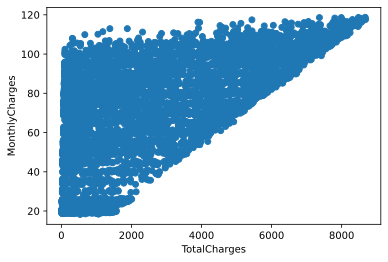
    


На данном графике все вполне логично и лаконично: в месяц покупатель не может платить больше, чем он заплатил всего


```python
import matplotlib.pyplot as plt
plt.scatter(data['TotalCharges'], data['tenure'])
plt.xlabel('TotalCharges')
plt.ylabel('tenure')
pass
```


    

    


На данном графике также все выглядит вполне корректно - чем больше клиент сотрудничает с компанией, тем больше заплатил <br>
Такж никаких "огромных" значений замечено не было. Следовательно, можно предположить, что выбросов нет

# Визуализация данных
Визуализируем данные для попытка найти некоторую корреляцию между переменными. Для начала изобразим попарные графики для всех колонок на случайной подвыборке


```python
np.random.seed(42)
random_subset = np.random.choice(np.arange(data.shape[0]), size=1000, replace=False)
```


```python
import seaborn as sns
sns.pairplot(data.iloc[random_subset], hue='Churn', diag_kind='hist')
plt.legend()
pass
```


    

    


Первое, что можно заметить, что в основном отток клиентов идет из категории, кто сравнительно мало заплатил суммарно, но достаточно много платил ежемесячно. Что вполне объяснимо, так как это те люди, кто "попробовал" услуги и им они не понравились + цена была завышенной.


```python
sns.scatterplot(x='MonthlyCharges', y='TotalCharges',hue='Churn', data=data, alpha=0.7)
pass
```


    
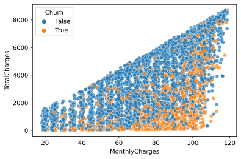
    


Тоже самое можно увидеть и на графике ниже: уходят в основном те, кто много платил в месяц, а также кто сравнительно немного времени провел с компанией (низкое значение tenure), в то время как пр высоких значениях tenure уходов клиентов практически нет


```python
sns.scatterplot(x='MonthlyCharges', y='tenure',hue='Churn', data=data, alpha=0.7)
pass
```


    
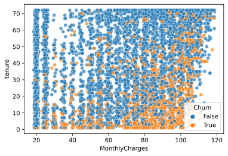
    


Также можно заметить, что достаточно много расторжений контрактов идет со стороны пенсионеров. Вполне возможно, что здесь подразумевается смерть человека и, как результат, отмена услуг


```python
sns.scatterplot(x='gender', y='SeniorCitizen',hue='Churn', data=data.iloc[random_subset], alpha=0.7)
pass
```


    
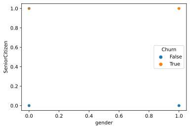
    


В подтверждение предыдущей мысли можно посмотреть на график ниже, где отмена договора происходит от людей без партнера (и особенно на пенсии). Вероятнее всего здесь также могут подразумеваться пожилые люди, у которых партнер умер


```python
sns.scatterplot(x='SeniorCitizen', y='Partner',hue='Churn', data=data.iloc[random_subset], alpha=0.7)
pass
```


    
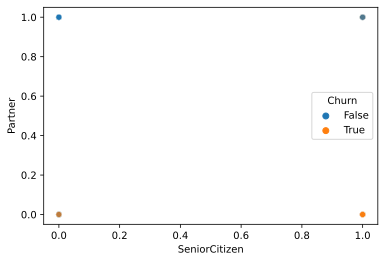
    


Остальные графики тяжело анализировать "глазами", поэтому построим матрицу корреляции


```python
corr_mat =data.corr()
corr_mat
```


<div>
<style scoped>
    .dataframe tbody tr th:only-of-type {
        vertical-align: middle;
    }

    .dataframe tbody tr th {
        vertical-align: top;
    }

    .dataframe thead th {
        text-align: right;
    }
</style>
<table border="1" class="dataframe">
  <thead>
    <tr style="text-align: right;">
      <th></th>
      <th>gender</th>
      <th>SeniorCitizen</th>
      <th>Partner</th>
      <th>Dependents</th>
      <th>tenure</th>
      <th>PhoneService</th>
      <th>PaperlessBilling</th>
      <th>MonthlyCharges</th>
      <th>TotalCharges</th>
      <th>Churn</th>
    </tr>
  </thead>
  <tbody>
    <tr>
      <th>gender</th>
      <td>1.000000</td>
      <td>-0.001819</td>
      <td>-0.001379</td>
      <td>0.010349</td>
      <td>0.005285</td>
      <td>-0.007515</td>
      <td>-0.011902</td>
      <td>-0.013779</td>
      <td>0.000048</td>
      <td>-0.008545</td>
    </tr>
    <tr>
      <th>SeniorCitizen</th>
      <td>-0.001819</td>
      <td>1.000000</td>
      <td>0.016957</td>
      <td>-0.210550</td>
      <td>0.015683</td>
      <td>0.008392</td>
      <td>0.156258</td>
      <td>0.219874</td>
      <td>0.102411</td>
      <td>0.150541</td>
    </tr>
    <tr>
      <th>Partner</th>
      <td>-0.001379</td>
      <td>0.016957</td>
      <td>1.000000</td>
      <td>0.452269</td>
      <td>0.381912</td>
      <td>0.018397</td>
      <td>-0.013957</td>
      <td>0.097825</td>
      <td>0.319072</td>
      <td>-0.149982</td>
    </tr>
    <tr>
      <th>Dependents</th>
      <td>0.010349</td>
      <td>-0.210550</td>
      <td>0.452269</td>
      <td>1.000000</td>
      <td>0.163386</td>
      <td>-0.001078</td>
      <td>-0.110131</td>
      <td>-0.112343</td>
      <td>0.064653</td>
      <td>-0.163128</td>
    </tr>
    <tr>
      <th>tenure</th>
      <td>0.005285</td>
      <td>0.015683</td>
      <td>0.381912</td>
      <td>0.163386</td>
      <td>1.000000</td>
      <td>0.007877</td>
      <td>0.004823</td>
      <td>0.246862</td>
      <td>0.825880</td>
      <td>-0.354049</td>
    </tr>
    <tr>
      <th>PhoneService</th>
      <td>-0.007515</td>
      <td>0.008392</td>
      <td>0.018397</td>
      <td>-0.001078</td>
      <td>0.007877</td>
      <td>1.000000</td>
      <td>0.016696</td>
      <td>0.248033</td>
      <td>0.113008</td>
      <td>0.011691</td>
    </tr>
    <tr>
      <th>PaperlessBilling</th>
      <td>-0.011902</td>
      <td>0.156258</td>
      <td>-0.013957</td>
      <td>-0.110131</td>
      <td>0.004823</td>
      <td>0.016696</td>
      <td>1.000000</td>
      <td>0.351930</td>
      <td>0.157830</td>
      <td>0.191454</td>
    </tr>
    <tr>
      <th>MonthlyCharges</th>
      <td>-0.013779</td>
      <td>0.219874</td>
      <td>0.097825</td>
      <td>-0.112343</td>
      <td>0.246862</td>
      <td>0.248033</td>
      <td>0.351930</td>
      <td>1.000000</td>
      <td>0.651065</td>
      <td>0.192858</td>
    </tr>
    <tr>
      <th>TotalCharges</th>
      <td>0.000048</td>
      <td>0.102411</td>
      <td>0.319072</td>
      <td>0.064653</td>
      <td>0.825880</td>
      <td>0.113008</td>
      <td>0.157830</td>
      <td>0.651065</td>
      <td>1.000000</td>
      <td>-0.199484</td>
    </tr>
    <tr>
      <th>Churn</th>
      <td>-0.008545</td>
      <td>0.150541</td>
      <td>-0.149982</td>
      <td>-0.163128</td>
      <td>-0.354049</td>
      <td>0.011691</td>
      <td>0.191454</td>
      <td>0.192858</td>
      <td>-0.199484</td>
      <td>1.000000</td>
    </tr>
  </tbody>
</table>
</div>


```python
import seaborn as sns
sns.heatmap(corr_mat, square=True, cmap='coolwarm')
```


    <AxesSubplot:>


    
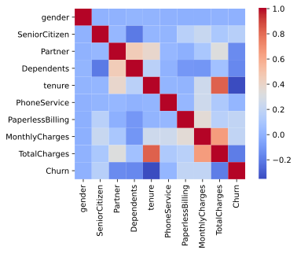
    


Из данной тепловой карты по корреляции также можно увидеть, что наибольшая зависимость "ухода" клиента связана с малым сроком использования услугами (почти сразу не понравилось и он ушел), что также подтверждает колонка TotalCharges, высокой ценой (MonthlyCharges), а также предположение о пенсионерах и людей без партнеров оказалось правдивым - небольшая корреляция есть <br>
Посмотрим на наиболее кореллированные переменные


```python
corr_mat.where(np.triu(corr_mat > 0.4, k=1)).stack().sort_values(ascending=False)
```


    tenure          TotalCharges    0.825880
    MonthlyCharges  TotalCharges    0.651065
    Partner         Dependents      0.452269
    dtype: float64


В целом здесь также все логично: чем больше срок обслуживания, тем больше клиент заплатил, то же самое справедливо и для ежемесячной цены. Если у человека есть партнер, то, вроятно, у него есть и дети. 

# Подготовка данных к классификатору
С категориальными признаками классификаторы работаьь не умеют, так что превратим их в "one-hot-vector"


```python
print(data.columns)
data = pd.get_dummies(data, categorical_columns)
print(data.columns)

```

    Index(['gender', 'SeniorCitizen', 'Partner', 'Dependents', 'tenure',
           'PhoneService', 'MultipleLines', 'InternetService', 'OnlineSecurity',
           'OnlineBackup', 'DeviceProtection', 'TechSupport', 'StreamingTV',
           'StreamingMovies', 'Contract', 'PaperlessBilling', 'PaymentMethod',
           'MonthlyCharges', 'TotalCharges', 'Churn'],
          dtype='object')
    Index(['gender', 'SeniorCitizen', 'Partner', 'Dependents', 'tenure',
           'PhoneService', 'PaperlessBilling', 'MonthlyCharges', 'TotalCharges',
           'Churn', 'MultipleLines_No', 'MultipleLines_No phone service',
           'MultipleLines_Yes', 'InternetService_DSL',
           'InternetService_Fiber optic', 'InternetService_No',
           'OnlineSecurity_No', 'OnlineSecurity_No internet service',
           'OnlineSecurity_Yes', 'OnlineBackup_No',
           'OnlineBackup_No internet service', 'OnlineBackup_Yes',
           'DeviceProtection_No', 'DeviceProtection_No internet service',
           'DeviceProtection_Yes', 'TechSupport_No',
           'TechSupport_No internet service', 'TechSupport_Yes', 'StreamingTV_No',
           'StreamingTV_No internet service', 'StreamingTV_Yes',
           'StreamingMovies_No', 'StreamingMovies_No internet service',
           'StreamingMovies_Yes', 'Contract_Month-to-month', 'Contract_One year',
           'Contract_Two year', 'PaymentMethod_Bank transfer (automatic)',
           'PaymentMethod_Credit card (automatic)',
           'PaymentMethod_Electronic check', 'PaymentMethod_Mailed check'],
          dtype='object')
    

Нормализуем данные


```python
for column in ['tenure', 'MonthlyCharges', 'TotalCharges']:
    data[column] = (data[column] - data[column].mean())/data[column].std()
```


```python
data.describe()
```


<div>
<style scoped>
    .dataframe tbody tr th:only-of-type {
        vertical-align: middle;
    }

    .dataframe tbody tr th {
        vertical-align: top;
    }

    .dataframe thead th {
        text-align: right;
    }
</style>
<table border="1" class="dataframe">
  <thead>
    <tr style="text-align: right;">
      <th></th>
      <th>tenure</th>
      <th>MonthlyCharges</th>
      <th>TotalCharges</th>
      <th>MultipleLines_No</th>
      <th>MultipleLines_No phone service</th>
      <th>MultipleLines_Yes</th>
      <th>InternetService_DSL</th>
      <th>InternetService_Fiber optic</th>
      <th>InternetService_No</th>
      <th>OnlineSecurity_No</th>
      <th>...</th>
      <th>StreamingMovies_No</th>
      <th>StreamingMovies_No internet service</th>
      <th>StreamingMovies_Yes</th>
      <th>Contract_Month-to-month</th>
      <th>Contract_One year</th>
      <th>Contract_Two year</th>
      <th>PaymentMethod_Bank transfer (automatic)</th>
      <th>PaymentMethod_Credit card (automatic)</th>
      <th>PaymentMethod_Electronic check</th>
      <th>PaymentMethod_Mailed check</th>
    </tr>
  </thead>
  <tbody>
    <tr>
      <th>count</th>
      <td>7.032000e+03</td>
      <td>7.032000e+03</td>
      <td>7.032000e+03</td>
      <td>7032.000000</td>
      <td>7032.000000</td>
      <td>7032.000000</td>
      <td>7032.000000</td>
      <td>7032.000000</td>
      <td>7032.000000</td>
      <td>7032.000000</td>
      <td>...</td>
      <td>7032.000000</td>
      <td>7032.000000</td>
      <td>7032.000000</td>
      <td>7032.000000</td>
      <td>7032.000000</td>
      <td>7032.000000</td>
      <td>7032.000000</td>
      <td>7032.000000</td>
      <td>7032.000000</td>
      <td>7032.000000</td>
    </tr>
    <tr>
      <th>mean</th>
      <td>-1.126643e-16</td>
      <td>5.203776e-17</td>
      <td>-1.134221e-16</td>
      <td>0.481371</td>
      <td>0.096701</td>
      <td>0.421928</td>
      <td>0.343572</td>
      <td>0.440273</td>
      <td>0.216155</td>
      <td>0.497298</td>
      <td>...</td>
      <td>0.395478</td>
      <td>0.216155</td>
      <td>0.388367</td>
      <td>0.551052</td>
      <td>0.209329</td>
      <td>0.239619</td>
      <td>0.219283</td>
      <td>0.216297</td>
      <td>0.336320</td>
      <td>0.228100</td>
    </tr>
    <tr>
      <th>std</th>
      <td>1.000000e+00</td>
      <td>1.000000e+00</td>
      <td>1.000000e+00</td>
      <td>0.499688</td>
      <td>0.295571</td>
      <td>0.493902</td>
      <td>0.474934</td>
      <td>0.496455</td>
      <td>0.411650</td>
      <td>0.500028</td>
      <td>...</td>
      <td>0.488988</td>
      <td>0.411650</td>
      <td>0.487414</td>
      <td>0.497422</td>
      <td>0.406858</td>
      <td>0.426881</td>
      <td>0.413790</td>
      <td>0.411748</td>
      <td>0.472483</td>
      <td>0.419637</td>
    </tr>
    <tr>
      <th>min</th>
      <td>-1.280157e+00</td>
      <td>-1.547173e+00</td>
      <td>-9.989982e-01</td>
      <td>0.000000</td>
      <td>0.000000</td>
      <td>0.000000</td>
      <td>0.000000</td>
      <td>0.000000</td>
      <td>0.000000</td>
      <td>0.000000</td>
      <td>...</td>
      <td>0.000000</td>
      <td>0.000000</td>
      <td>0.000000</td>
      <td>0.000000</td>
      <td>0.000000</td>
      <td>0.000000</td>
      <td>0.000000</td>
      <td>0.000000</td>
      <td>0.000000</td>
      <td>0.000000</td>
    </tr>
    <tr>
      <th>25%</th>
      <td>-9.542285e-01</td>
      <td>-9.709078e-01</td>
      <td>-8.301898e-01</td>
      <td>0.000000</td>
      <td>0.000000</td>
      <td>0.000000</td>
      <td>0.000000</td>
      <td>0.000000</td>
      <td>0.000000</td>
      <td>0.000000</td>
      <td>...</td>
      <td>0.000000</td>
      <td>0.000000</td>
      <td>0.000000</td>
      <td>0.000000</td>
      <td>0.000000</td>
      <td>0.000000</td>
      <td>0.000000</td>
      <td>0.000000</td>
      <td>0.000000</td>
      <td>0.000000</td>
    </tr>
    <tr>
      <th>50%</th>
      <td>-1.394072e-01</td>
      <td>1.845309e-01</td>
      <td>-3.907873e-01</td>
      <td>0.000000</td>
      <td>0.000000</td>
      <td>0.000000</td>
      <td>0.000000</td>
      <td>0.000000</td>
      <td>0.000000</td>
      <td>0.000000</td>
      <td>...</td>
      <td>0.000000</td>
      <td>0.000000</td>
      <td>0.000000</td>
      <td>1.000000</td>
      <td>0.000000</td>
      <td>0.000000</td>
      <td>0.000000</td>
      <td>0.000000</td>
      <td>0.000000</td>
      <td>0.000000</td>
    </tr>
    <tr>
      <th>75%</th>
      <td>9.198605e-01</td>
      <td>8.330889e-01</td>
      <td>6.667797e-01</td>
      <td>1.000000</td>
      <td>0.000000</td>
      <td>1.000000</td>
      <td>1.000000</td>
      <td>1.000000</td>
      <td>0.000000</td>
      <td>1.000000</td>
      <td>...</td>
      <td>1.000000</td>
      <td>0.000000</td>
      <td>1.000000</td>
      <td>1.000000</td>
      <td>0.000000</td>
      <td>0.000000</td>
      <td>0.000000</td>
      <td>0.000000</td>
      <td>1.000000</td>
      <td>0.000000</td>
    </tr>
    <tr>
      <th>max</th>
      <td>1.612459e+00</td>
      <td>1.793254e+00</td>
      <td>2.824061e+00</td>
      <td>1.000000</td>
      <td>1.000000</td>
      <td>1.000000</td>
      <td>1.000000</td>
      <td>1.000000</td>
      <td>1.000000</td>
      <td>1.000000</td>
      <td>...</td>
      <td>1.000000</td>
      <td>1.000000</td>
      <td>1.000000</td>
      <td>1.000000</td>
      <td>1.000000</td>
      <td>1.000000</td>
      <td>1.000000</td>
      <td>1.000000</td>
      <td>1.000000</td>
      <td>1.000000</td>
    </tr>
  </tbody>
</table>
<p>8 rows × 34 columns</p>
</div>


```python
data.head()
```


<div>
<style scoped>
    .dataframe tbody tr th:only-of-type {
        vertical-align: middle;
    }

    .dataframe tbody tr th {
        vertical-align: top;
    }

    .dataframe thead th {
        text-align: right;
    }
</style>
<table border="1" class="dataframe">
  <thead>
    <tr style="text-align: right;">
      <th></th>
      <th>gender</th>
      <th>SeniorCitizen</th>
      <th>Partner</th>
      <th>Dependents</th>
      <th>tenure</th>
      <th>PhoneService</th>
      <th>PaperlessBilling</th>
      <th>MonthlyCharges</th>
      <th>TotalCharges</th>
      <th>Churn</th>
      <th>...</th>
      <th>StreamingMovies_No</th>
      <th>StreamingMovies_No internet service</th>
      <th>StreamingMovies_Yes</th>
      <th>Contract_Month-to-month</th>
      <th>Contract_One year</th>
      <th>Contract_Two year</th>
      <th>PaymentMethod_Bank transfer (automatic)</th>
      <th>PaymentMethod_Credit card (automatic)</th>
      <th>PaymentMethod_Electronic check</th>
      <th>PaymentMethod_Mailed check</th>
    </tr>
  </thead>
  <tbody>
    <tr>
      <th>0</th>
      <td>False</td>
      <td>False</td>
      <td>True</td>
      <td>False</td>
      <td>-1.280157</td>
      <td>False</td>
      <td>True</td>
      <td>-1.161611</td>
      <td>-0.994123</td>
      <td>False</td>
      <td>...</td>
      <td>1</td>
      <td>0</td>
      <td>0</td>
      <td>1</td>
      <td>0</td>
      <td>0</td>
      <td>0</td>
      <td>0</td>
      <td>1</td>
      <td>0</td>
    </tr>
    <tr>
      <th>1</th>
      <td>True</td>
      <td>False</td>
      <td>False</td>
      <td>False</td>
      <td>0.064298</td>
      <td>True</td>
      <td>False</td>
      <td>-0.260859</td>
      <td>-0.173727</td>
      <td>False</td>
      <td>...</td>
      <td>1</td>
      <td>0</td>
      <td>0</td>
      <td>0</td>
      <td>1</td>
      <td>0</td>
      <td>0</td>
      <td>0</td>
      <td>0</td>
      <td>1</td>
    </tr>
    <tr>
      <th>2</th>
      <td>True</td>
      <td>False</td>
      <td>False</td>
      <td>False</td>
      <td>-1.239416</td>
      <td>True</td>
      <td>True</td>
      <td>-0.363897</td>
      <td>-0.959581</td>
      <td>True</td>
      <td>...</td>
      <td>1</td>
      <td>0</td>
      <td>0</td>
      <td>1</td>
      <td>0</td>
      <td>0</td>
      <td>0</td>
      <td>0</td>
      <td>0</td>
      <td>1</td>
    </tr>
    <tr>
      <th>3</th>
      <td>True</td>
      <td>False</td>
      <td>False</td>
      <td>False</td>
      <td>0.512450</td>
      <td>False</td>
      <td>False</td>
      <td>-0.747797</td>
      <td>-0.195234</td>
      <td>False</td>
      <td>...</td>
      <td>1</td>
      <td>0</td>
      <td>0</td>
      <td>0</td>
      <td>1</td>
      <td>0</td>
      <td>1</td>
      <td>0</td>
      <td>0</td>
      <td>0</td>
    </tr>
    <tr>
      <th>4</th>
      <td>False</td>
      <td>False</td>
      <td>False</td>
      <td>False</td>
      <td>-1.239416</td>
      <td>True</td>
      <td>True</td>
      <td>0.196164</td>
      <td>-0.940391</td>
      <td>True</td>
      <td>...</td>
      <td>1</td>
      <td>0</td>
      <td>0</td>
      <td>1</td>
      <td>0</td>
      <td>0</td>
      <td>0</td>
      <td>0</td>
      <td>1</td>
      <td>0</td>
    </tr>
  </tbody>
</table>
<p>5 rows × 41 columns</p>
</div>


Попробуем натравить классификатор. Для начала разобьем данные на X и Y, а также на train и test


```python
X = data.drop(['Churn'], axis=1)
y = data['Churn']
```


```python
from sklearn.model_selection import train_test_split
def split(X, y):
    X_train, X_test, y_train, y_test = train_test_split(X, y, test_size = 0.30, random_state = 42, )

    N_train, _ = X_train.shape 
    N_test,  _ = X_test.shape 

    print(N_train, N_test)
    #print(y_test.describe())
    #print(y_train.describe())
    return X_train, X_test, y_train, y_test
X_train, X_test, y_train, y_test = split(X, y)
```

    4922 2110
    

# Классификация:
## KNN


```python
from sklearn.neighbors import KNeighborsClassifier
```


```python
def train_knn(X_train, X_test, y_train, y_test):
    best_knn = None
    best_score = 0
    for neighbors in [1, 3, 5, 10, 20, 50, 100, 150, 200, 300]:
        knn = KNeighborsClassifier(n_neighbors = neighbors)
        knn.fit(X_train, y_train)
        score = knn.score(X_test, y_test)
        if score >= best_score:
            best_knn = knn
            best_score = score
    print(f'Best score on test set: {best_score} neighbors {best_knn.n_neighbors}')
    return best_knn
knn = train_knn(X_train, X_test, y_train, y_test)
```

    Best score on test set: 0.7909952606635071 neighbors 50
    

Лучший результат при 50 соседях. Поизучаем более детально


```python
y_test_predict = knn.predict(X_test)
```


```python
from sklearn.metrics import confusion_matrix

print(confusion_matrix(y_test, y_test_predict))
```

    [[1356  193]
     [ 248  313]]
    

Итак, подавляющее большинство значений классификатор угадывает корректно, особенно хорошо он справляется с угадыванием НЕ ушедших клиентов (впрочем, их больше, чем ушедших). Рассмотрим больше метрик


```python
from sklearn.metrics import classification_report
print(classification_report(y_test, y_test_predict))
```

                  precision    recall  f1-score   support
    
           False       0.85      0.88      0.86      1549
            True       0.62      0.56      0.59       561
    
        accuracy                           0.79      2110
       macro avg       0.73      0.72      0.72      2110
    weighted avg       0.79      0.79      0.79      2110
    
    

Данные метрики также подтверждают предыдущие выводы: 88% НЕ ушедших клиентов классификатор смог найти и всего 85% классифицированных объектов, как "не ушедший" клиент оказалось правдой, F-мера также достаточно высока для этого класса, однако с "ушедшими" клиентами все несколько хуже и точность уже ниже


```python
sns.scatterplot(x='MonthlyCharges', y='tenure', hue='Churn', data=pd.concat((X_test, y_test), axis=1), alpha=0.7)
```


    <AxesSubplot:xlabel='MonthlyCharges', ylabel='tenure'>


    
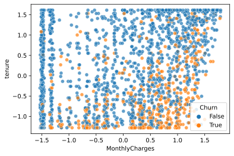
    


```python
sns.scatterplot(x='MonthlyCharges', y='tenure', hue='Churn', data=pd.concat((X_test, pd.DataFrame(y_test_predict, columns=['Churn'])), axis=1), alpha=0.8)
```


    <AxesSubplot:xlabel='MonthlyCharges', ylabel='tenure'>


    
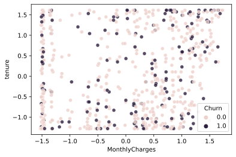
    


Посмотрим ради интереса, каковые метрики на тренировочных данных


```python
y_train_predict = knn.predict(X_train)
knn.score(X_train, y_train)
```


    0.8027224705404307


```python
from sklearn.metrics import classification_report
print(classification_report(y_train, y_train_predict))
```

                  precision    recall  f1-score   support
    
           False       0.85      0.88      0.87      3614
            True       0.64      0.58      0.61      1308
    
        accuracy                           0.80      4922
       macro avg       0.75      0.73      0.74      4922
    weighted avg       0.80      0.80      0.80      4922
    
    

В целом такой же результат, что и на тестовых данных. Объяснить это можно неоднородностью данных и отсутствием "явного" критерия, по которому можно определить, что клиент откажется от услуг (о чем свидетельстует таблица  корреляции).

## Попробуем другие классификаторы


```python
def check_classifier(classifier, X_tr, y_tr, X_te, y_te):
    classifier.fit(X_tr, y_tr)

    err_train = np.mean(y_tr != classifier.predict(X_tr))
    err_test  = np.mean(y_te  != classifier.predict(X_te))

    print(f' {str(classifier)} Score on train: {1-err_train}, score on test {1-err_test}') 
    return classifier
```


```python
from sklearn.svm import SVC
check_classifier(SVC(gamma='auto'), X_train, y_train, X_test, y_test)
```

     SVC(gamma='auto') Score on train: 0.8053636733035352, score on test 0.7914691943127963
    


    SVC(gamma='auto')


```python
from sklearn import ensemble
rf = check_classifier(ensemble.RandomForestClassifier(n_estimators = 1000), X_train, y_train, X_test, y_test)
```

     RandomForestClassifier(n_estimators=1000) Score on train: 0.9985778138967899, score on test 0.7815165876777251
    

Посмотрим на значимость колонок, используемых в деревьях


```python
importances = rf.feature_importances_
indices = np.argsort(importances)[::-1]

print("Feature ranking:")

for f in range(X_test.shape[1]):
    print("%2d. feature '%5s' (%f)" % (f + 1, X_test.columns[indices[f]], importances[indices[f]]))
```

    Feature ranking:
     1. feature 'TotalCharges' (0.166828)
     2. feature 'MonthlyCharges' (0.148908)
     3. feature 'tenure' (0.144120)
     4. feature 'Contract_Month-to-month' (0.059540)
     5. feature 'OnlineSecurity_No' (0.031107)
     6. feature 'TechSupport_No' (0.028169)
     7. feature 'gender' (0.028160)
     8. feature 'InternetService_Fiber optic' (0.028108)
     9. feature 'PaymentMethod_Electronic check' (0.027765)
    10. feature 'PaperlessBilling' (0.024124)
    11. feature 'Partner' (0.023501)
    12. feature 'SeniorCitizen' (0.020827)
    13. feature 'Dependents' (0.018833)
    14. feature 'Contract_Two year' (0.016954)
    15. feature 'OnlineBackup_No' (0.016817)
    16. feature 'DeviceProtection_No' (0.014062)
    17. feature 'MultipleLines_No' (0.013517)
    18. feature 'PaymentMethod_Credit card (automatic)' (0.013320)
    19. feature 'MultipleLines_Yes' (0.012808)
    20. feature 'OnlineBackup_Yes' (0.012649)
    21. feature 'PaymentMethod_Bank transfer (automatic)' (0.011914)
    22. feature 'TechSupport_Yes' (0.011739)
    23. feature 'StreamingMovies_Yes' (0.011685)
    24. feature 'StreamingTV_Yes' (0.011663)
    25. feature 'PaymentMethod_Mailed check' (0.011466)
    26. feature 'DeviceProtection_Yes' (0.011423)
    27. feature 'StreamingMovies_No' (0.011396)
    28. feature 'StreamingTV_No' (0.011310)
    29. feature 'OnlineSecurity_Yes' (0.011256)
    30. feature 'InternetService_DSL' (0.011239)
    31. feature 'Contract_One year' (0.011160)
    32. feature 'MultipleLines_No phone service' (0.003591)
    33. feature 'PhoneService' (0.003573)
    34. feature 'StreamingTV_No internet service' (0.002771)
    35. feature 'TechSupport_No internet service' (0.002468)
    36. feature 'DeviceProtection_No internet service' (0.002404)
    37. feature 'InternetService_No' (0.002336)
    38. feature 'OnlineSecurity_No internet service' (0.002227)
    39. feature 'StreamingMovies_No internet service' (0.002179)
    40. feature 'OnlineBackup_No internet service' (0.002083)
    

В целом ничего сильного нового здесь нельзя заметить, по-прежнему наиболее влиятельными колонками остаются потраченная сумма, ежемесечнеый платеж и время, проведенное клиентом с компанией. Наличие же или отсутствие тех или иных услуг не сильно сказываются на финальном ответе


```python
plt.title("Feature importances")
plt.bar(range(importances.shape[0]), importances[indices], align = 'center', color = 'r')
plt.xticks(range(importances.shape[0]), X_test.columns[indices], rotation = 90)
pass
```


    
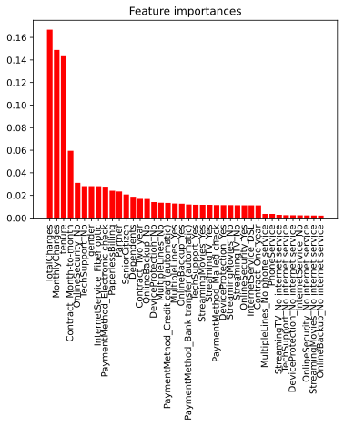
    


Стоит попробовать оставить только эти колонки в датасете, возможно, это улучшит качество


```python
X_train_less = X_train.drop(X_test.columns[indices[3:]], axis=1)
X_test_less = X_test.drop(X_test.columns[indices[3:]], axis=1)
X_train_less.columns
```


    Index(['tenure', 'MonthlyCharges', 'TotalCharges'], dtype='object')


```python
train_knn(X_train_less, X_test_less, y_train, y_test)
```

    Best score on test set: 0.7881516587677725 neighbors 150
    


    KNeighborsClassifier(n_neighbors=150)


```python
from sklearn import ensemble
check_classifier(ensemble.RandomForestClassifier(n_estimators = 1000), X_train_less, y_train, X_test_less, y_test)
```

     RandomForestClassifier(n_estimators=1000) Score on train: 0.9904510361641609, score on test 0.7530805687203792
    


    RandomForestClassifier(n_estimators=1000)


К сожалению, чуда не произошло, оно и понятно - пусть остальные колонки и вносят сравнительно мало информации, но все-таки они её вносят, что сказыается на финальном качестве классификатора

## Попробуем побороться с несбалансированностью классов <br>
Первый способ - выровнять количество элементов в каждом классе, удалив "лишние"


```python
from collections import Counter
from imblearn.under_sampling import RandomUnderSampler
rus = RandomUnderSampler(random_state=42)
X_res, y_res = rus.fit_resample(X, y)
print('Resampled dataset shape %s' % Counter(y_res))
X_train, X_test, y_train, y_test = split(X_res, y_res)
train_knn(X_train, X_test, y_train, y_test)
```

    Resampled dataset shape Counter({False: 1869, True: 1869})
    2616 1122
    count      1122
    unique        2
    top       False
    freq        578
    Name: Churn, dtype: object
    count     2616
    unique       2
    top       True
    freq      1325
    Name: Churn, dtype: object
    Best score on test set: 0.7442067736185384 neighbors 10
    


    KNeighborsClassifier(n_neighbors=10)


Лучше не стало... В данном случае "уменьшение количества экземпляров" попросту убрало большое количество данных.<br> Попробуем способ NearMiss. Он заключается в том, что если имеются места большого скопления бОльшего класса, то некоторые точки просто  удаляются(как бы объединяются в одну)


```python
from imblearn.under_sampling import NearMiss
nm = NearMiss()
X_res, y_res = nm.fit_resample(X, y)
print('Resampled dataset shape %s' % Counter(y_res))
X_train, X_test, y_train, y_test = split(X_res, y_res)
knn = train_knn(X_train, X_test, y_train, y_test)
print(classification_report(y_test, knn.predict(X_test)))
```

    Resampled dataset shape Counter({False: 1869, True: 1869})
    2616 1122
    count      1122
    unique        2
    top       False
    freq        578
    Name: Churn, dtype: object
    count     2616
    unique       2
    top       True
    freq      1325
    Name: Churn, dtype: object
    Best score on test set: 0.679144385026738 neighbors 300
                  precision    recall  f1-score   support
    
           False       0.74      0.57      0.65       578
            True       0.64      0.79      0.70       544
    
        accuracy                           0.68      1122
       macro avg       0.69      0.68      0.68      1122
    weighted avg       0.69      0.68      0.68      1122
    
    

Также не стало лучше, что можно понять, так как мы еще и класс "не ушедших" испортили, уменьшив количество точек, проредив их ряды <br>
Попробуем еще один способ. Вместо "уменьшения" бОльшего класса попробуем увеличить меньший класс путем добавления искусственных точек(по сути своей они будут являться копиями оригинальных, но с некоторыми случайными изменениями)


```python
from imblearn.over_sampling import RandomOverSampler
ros = RandomOverSampler(random_state=42)
X_res, y_res = ros.fit_resample(X, y)
print('Resampled dataset shape %s' % Counter(y_res))
X_train, X_test, y_train, y_test = split(X_res, y_res)
knn = train_knn(X_train, X_test, y_train, y_test)
print(classification_report(y_test, knn.predict(X_test)))
```

    Resampled dataset shape Counter({False: 5163, True: 5163})
    7228 3098
    count      3098
    unique        2
    top       False
    freq       1563
    Name: Churn, dtype: object
    count     7228
    unique       2
    top       True
    freq      3628
    Name: Churn, dtype: object
    Best score on test set: 0.8460296965784377 neighbors 1
                  precision    recall  f1-score   support
    
           False       0.92      0.76      0.83      1563
            True       0.79      0.93      0.86      1535
    
        accuracy                           0.85      3098
       macro avg       0.86      0.85      0.85      3098
    weighted avg       0.86      0.85      0.84      3098
    
    

А вот здесь уже достаточно интересные результаты... Лучший результат при одном ближайшем соседе.. Посмотрим на графики


```python
sns.scatterplot(x='MonthlyCharges', y='tenure', hue='Churn', data=pd.concat((X_test, y_test), axis=1), alpha=0.7)
```


    <AxesSubplot:xlabel='MonthlyCharges', ylabel='tenure'>


    
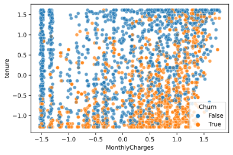
    


```python
sns.scatterplot(x='MonthlyCharges', y='tenure', hue='Churn', data=pd.concat((X_test, pd.DataFrame(knn.predict(X_test), columns=['Churn'])), axis=1), alpha=0.8)
```


    <AxesSubplot:xlabel='MonthlyCharges', ylabel='tenure'>


    
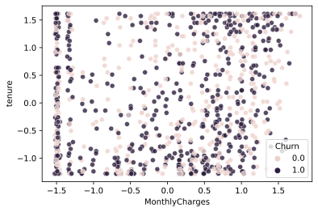
    


В целом графики выглядят очень похоже на оригинальные, так что нет такого, что ситуация изменилась радикально, после дополнения датасетов, однако, объяснить точную причину улучшения качества я не могу. Возможно, дело в том, что попросту точек стало больше и появилось "больше соседей" меньшего класса в бОльшем количестве мест

# PCA
- [x] К вашим данным применить PCA для сокращения размерности пространства признаков. 
- [x] Изобразить точки, сократив размерность пространства до 2. 
- [ ] К новым данным применить SVM. 
- [ ] Построить графики зависимости ошибки на тестовой и обучающей выборки в зависимости от количества используемых компонент. 
- [ ] Найти наилучшее значение количества используемых главных компонент. 
- [ ] Позволяет ли PCA снизить ошибку? Сделать выводы. <br>


Прменим метод главных компонент для уменьшения размерности


```python
from sklearn.decomposition import PCA
pca = PCA(n_components = 2)
pca.fit(X)
X_pca = pca.transform(X)
print(X.shape)
print(X_pca.shape)
print(pca.explained_variance_)
```

    (7032, 40)
    (7032, 2)
    [3.3026222  2.14541545]
    

Проверим результат на нашем любимом KNN


```python
X_train, X_test, y_train, y_test = split(X_pca, y)
knn = train_knn(X_train, X_test, y_train, y_test)
print(classification_report(y_test, knn.predict(X_test)))
```

    4922 2110
    count      2110
    unique        2
    top       False
    freq       1549
    Name: Churn, dtype: object
    count      4922
    unique        2
    top       False
    freq       3614
    Name: Churn, dtype: object
    Best score on test set: 0.79478672985782 neighbors 150
                  precision    recall  f1-score   support
    
           False       0.83      0.90      0.87      1549
            True       0.65      0.51      0.57       561
    
        accuracy                           0.79      2110
       macro avg       0.74      0.70      0.72      2110
    weighted avg       0.78      0.79      0.79      2110
    
    

Даже для KNN результат стал немного лучше по сравнению с оригинальными данными (0.7909 vs 0.7947). Изобразим точки:


```python

plt.scatter(X_pca[y == False, 0], X_pca[y == False, 1], color = 'r', alpha = 0.55, label = 'Churn = False')
plt.scatter(X_pca[y == True, 0], X_pca[y == True, 1], color = 'g', alpha = 0.55, label = 'Churn = True')
plt.legend()
```


    <matplotlib.legend.Legend at 0x1ed5f636508>


    
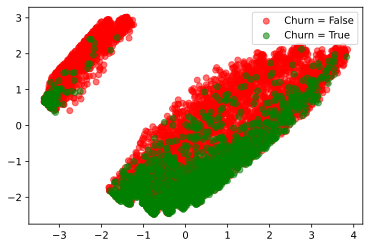
    


В целом по графикам видно, что данные по классам стали более сильно сгруппированы, чем можно и объяснить более высокие результаты в KNN. Проверим теперь результаты для SVM


```python
from sklearn.svm import SVC
check_classifier(SVC(gamma='auto'), X_train, y_train, X_test, y_test)
```

     SVC(gamma='auto') Score on train: 0.8010971149939049, score on test 0.7895734597156399
    


    SVC(gamma='auto')


Как видно из данного результата, при двух главных компонентах результат слегка стал хуже относительно использования всех данных. Попробуем поэксперементировать с количеством компонент


```python
for comp in [1, 2, 5, 10, 13, 15, 19]:
    pca = PCA(n_components = comp)
    pca.fit(X)
    X_pca = pca.transform(X)
    X_train, X_test, y_train, y_test = split(X_pca, y)
    print(f"Components {comp}")
    check_classifier(SVC(gamma='auto'), X_train, y_train, X_test, y_test)
```

    4922 2110
    count      2110
    unique        2
    top       False
    freq       1549
    Name: Churn, dtype: object
    count      4922
    unique        2
    top       False
    freq       3614
    Name: Churn, dtype: object
    Components 1
     SVC(gamma='auto') Score on train: 0.7342543681430314, score on test 0.7341232227488151
    4922 2110
    count      2110
    unique        2
    top       False
    freq       1549
    Name: Churn, dtype: object
    count      4922
    unique        2
    top       False
    freq       3614
    Name: Churn, dtype: object
    Components 2
     SVC(gamma='auto') Score on train: 0.8010971149939049, score on test 0.7895734597156399
    4922 2110
    count      2110
    unique        2
    top       False
    freq       1549
    Name: Churn, dtype: object
    count      4922
    unique        2
    top       False
    freq       3614
    Name: Churn, dtype: object
    Components 5
     SVC(gamma='auto') Score on train: 0.8063795205201137, score on test 0.79478672985782
    4922 2110
    count      2110
    unique        2
    top       False
    freq       1549
    Name: Churn, dtype: object
    count      4922
    unique        2
    top       False
    freq       3614
    Name: Churn, dtype: object
    Components 10
     SVC(gamma='auto') Score on train: 0.8086143843965867, score on test 0.7985781990521327
    4922 2110
    count      2110
    unique        2
    top       False
    freq       1549
    Name: Churn, dtype: object
    count      4922
    unique        2
    top       False
    freq       3614
    Name: Churn, dtype: object
    Components 13
     SVC(gamma='auto') Score on train: 0.8130841121495327, score on test 0.7966824644549764
    4922 2110
    count      2110
    unique        2
    top       False
    freq       1549
    Name: Churn, dtype: object
    count      4922
    unique        2
    top       False
    freq       3614
    Name: Churn, dtype: object
    Components 15
     SVC(gamma='auto') Score on train: 0.8104429093864283, score on test 0.7924170616113744
    4922 2110
    count      2110
    unique        2
    top       False
    freq       1549
    Name: Churn, dtype: object
    count      4922
    unique        2
    top       False
    freq       3614
    Name: Churn, dtype: object
    Components 19
     SVC(gamma='auto') Score on train: 0.810646078829744, score on test 0.79478672985782
    

# Итог
После проделанной работы по подготовке датасето, визуализации, а также построению классификаторов с разными параметрами можно сделать вывод, что данный датасет поддается классификации такими способами (о чем свидетельствует качество 79%+), однако, не слишком хорошо. Связано это с двумя вещами: неоднородность классов (НЕ ушедших клиентов значительно больше, чем ушедших), а также низкая корреляция целевой переменной с любыми другими (не больше 0.20 по модулю в среднем - лишь одна переменная коррелирует со значением -0.35). В подтверждение этих суждений говорят и приведенные выше рассуждения после изучения датасета "глазами" при помощи графиков и тд.


```python
!python -m jupyter nbconvert --to markdown lab-1.ipynb
pass
```

    [NbConvertApp] Converting notebook lab-1.ipynb to markdown
    [NbConvertApp] Support files will be in lab-1_files\
    [NbConvertApp] Making directory lab-1_files
    [NbConvertApp] Making directory lab-1_files
    [NbConvertApp] Making directory lab-1_files
    [NbConvertApp] Making directory lab-1_files
    [NbConvertApp] Making directory lab-1_files
    [NbConvertApp] Making directory lab-1_files
    [NbConvertApp] Making directory lab-1_files
    [NbConvertApp] Making directory lab-1_files
    [NbConvertApp] Making directory lab-1_files
    [NbConvertApp] Making directory lab-1_files
    [NbConvertApp] Making directory lab-1_files
    [NbConvertApp] Making directory lab-1_files
    [NbConvertApp] Making directory lab-1_files
    [NbConvertApp] Making directory lab-1_files
    [NbConvertApp] Making directory lab-1_files
    [NbConvertApp] Making directory lab-1_files
    [NbConvertApp] Making directory lab-1_files
    [NbConvertApp] Making directory lab-1_files
    [NbConvertApp] Making directory lab-1_files
    [NbConvertApp] Making directory lab-1_files
    [NbConvertApp] Making directory lab-1_files
    [NbConvertApp] Making directory lab-1_files
    [NbConvertApp] Making directory lab-1_files
    [NbConvertApp] Making directory lab-1_files
    [NbConvertApp] Making directory lab-1_files
    [NbConvertApp] Making directory lab-1_files
    [NbConvertApp] Writing 52949 bytes to lab-1.md
    
